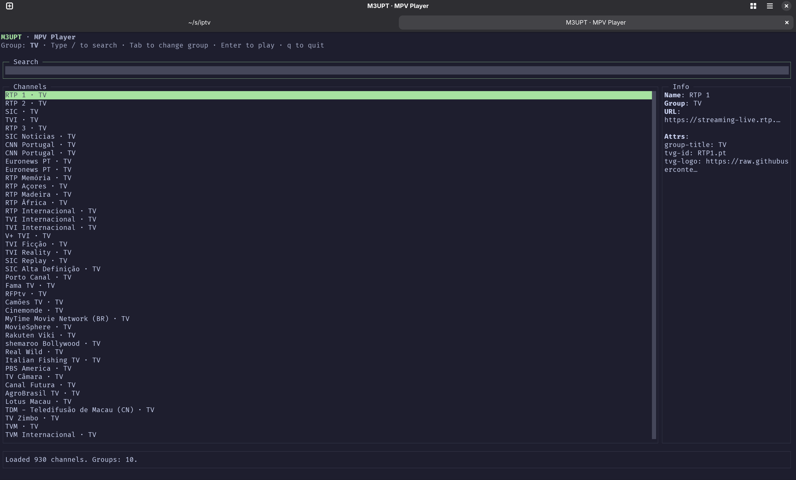

# IPTV PT Terminal

A terminal-based TUI (Text User Interface) for browsing and playing Portuguese IPTV channels using the M3UPT playlist.



## Features

- Browse Portuguese TV and radio channels
- Search and filter channels by name or group
- Group-based navigation with Tab/Shift+Tab
- Play channels directly in mpv
- Live playlist reloading
- Clean terminal interface using blessed

## Requirements

- Node.js 18+ or Bun
- mpv media player
- Terminal with Unicode support

## Installation

```bash
# Clone the repository
git clone https://github.com/yourusername/iptv-pt-term.git
cd iptv-pt-term

# Install dependencies
npm install
# or with Bun
bun install
```

## Usage

```bash
# Run with Node.js + tsx
npx tsx index.ts

# Run with Bun
bun run index.ts

# Options
npx tsx index.ts --stay     # Keep TUI open after launching mpv
npx tsx index.ts --mpv vlc  # Use different media player
```

## Controls

- `/` or `s` - Focus search box
- `Tab` / `Shift+Tab` - Cycle through channel groups
- `Enter` - Play selected channel in mpv
- `r` - Reload playlist
- `q`, `Esc`, or `Ctrl+C` - Quit

## Playlist Source

This application uses the M3UPT playlist from [LITUATUI/M3UPT](https://github.com/LITUATUI/M3UPT), which provides Portuguese TV and radio stations with public and official streams only.

## License

MIT
